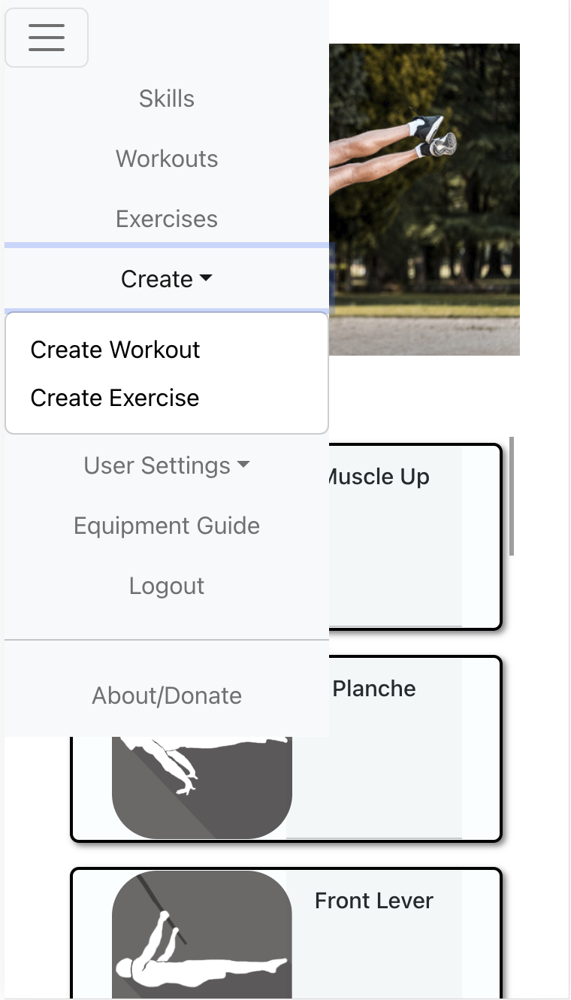

# GravityGains - Your Personal Calisthenics/Workout Application

GravityGains is your ultimate companion on the journey to mastering calisthenics, elevating your bodyweight skills, and achieving unparalleled strength and confidence. This full-stack application is designed to guide users through a progressive series of workouts, offering default programs for beginners, intermediates, and advanced practitioners.

<div style="display: flex; justify-content: space-around;">
    
    
</div>


## Key Features:

- **Progressive Calisthenics Workouts:**
  GravityGains provides thoughtfully curated workouts that seamlessly progress from foundational exercises to advanced calisthenics skills. Each stage is carefully crafted to ensure users master essential movements before advancing to more challenging exercises.

- **Skill-Centric Progressions:**
  The app focuses on skill development by breaking down complex movements into achievable progressions. Users are guided through a step-by-step process, laying the groundwork for mastering skills like handstands, muscle-ups, and levers.

- **Video Demonstrations:**
  Visualize success with clear and detailed video demonstrations for each exercise. GravityGains ensures users maintain proper form and technique, enhancing the learning experience and minimizing the risk of injury.

- **Full CRUD on the Exercise Model:**
  Tune your own personal list of exercises indexed in the User Exercise tab in the navigation.

## Upcoming Key Features:

- **Customized Training Programs:**
  Tailor your fitness journey with customizable training programs that align with your goals. Whether you're aiming to conquer specific calisthenics skills or enhance overall strength, GravityGains adapts to your unique aspirations.

- **Optional Equipment Page:**
  Explore a page full of documentation on the latest equipment to assist in your progressions, as well as options available for purchase.

- **Full CRUD Against All Models:**
  Enjoy complete control and customization with full CRUD capabilities across all models.


<!-- User-Friendly Interface:
Navigate through your workouts, track progress, and customize training plans effortlessly with GravityGains' user-friendly interface. Access your personalized routines and monitor achievements seamlessly. -->

<!-- Community Connection:
Join a thriving community within GravityGains where users share their triumphs, offer support, and motivate each other. Engage in discussions, exchange tips, and celebrate milestones together. -->

<!-- Achievement Unlockables:
Earn achievement badges as you conquer milestones and master specific skills. GravityGains adds an element of gamification to your fitness journey, making every achievement a celebration of progress. -->

<!-- Comprehensive Nutritional Support:
Complement your workouts with nutritional guidance tailored to your calisthenics goals. GravityGains takes a holistic approach, ensuring users have the knowledge and support needed for optimal performance. -->

<!-- Share Workouts/Exercises (Stretch)
As a memeber of GGs the User may export workouts in Json format and send the file to another user so that they can have access to the same workouts/Exercises -->


## Component Hierarchy Diagram


## Entity-Relationship Diagram (ERD)


## Installation Guide

1. Download the project from GitHub:
   - Navigate to the project via the URL.
   - In the GitHub code tab, click on the green "Code" button located on the right of the screen.
   - Copy the HTTP or SSH or GitHub CLI URL.
   - In your local terminal, type the following commands:
     git clone {the URL you just copied}
    Example:
    ```
    git clone https://github.com/TechALynch/GravityGains.git
    ```
   - Press Enter.
   2. If you wish to connect your own MongoDB Atlas database:

   a. Navigate to the `db` directory:
      ```
      cd /GravityGains/backEnd/db
      ```

   b. Open the `index.js` file:
      ```
      nano index.js
      ```

   c. Locate the `.connect` function in the file and replace the connection string with your MongoDB Atlas connection string.

   Example:
   ```javascript
   mongoose
       .connect('your_mongodb_atlas_connection_string_here')
       .then(() => {
           console.log('Successfully connected to MongoDB.')
       })
       .catch(e => {
           console.error('Connection error', e.message)
       })
    ```
    d. Save the changes and exit the editor.

    e. Run the following sommand to `seed` the database and sync with atlas. 
      ```
      node GravityGains/backEnd/seed/seedData.js
      ```
    f. Now naviage to the backend parent directory and run the following comman to install dependancies.
      ```
      cd GravityGains/backEnd
      ```
      and 
      ```
      npm i 
      ```

    g. Now, that we have all the installations run the backend server. 
      ```
      npm run dev
      ```

Your backend will now be connected to the specified MongoDB Atlas database. Make sure to replace 'your_mongodb_atlas_connection_string_here' with the actual connection string provided by MongoDB Atlas.

For more information, please visit the Atlas Documentation: https://www.mongodb.com/docs/atlas/mongodb-for-vscode/

This section provides instructions for users who want to connect their own MongoDB Atlas database by updating the connection string in the `index.js` file. Adjust the instructions based on the specifics of your project and MongoDB Atlas configuration.

<!-- 3. Setting up Auth0

    a. Create an Auth0 Account:

    - If you don't have an Auth0 account, sign up at Auth0.
    - Create a New Application:

    b. Once logged in, go to the Auth0 Dashboard.
        - Click on "Create Application."
        - Choose a name for your application, select the application type (Single Page Web Applications for React), and click "Create."
        - Get Auth0 Credentials:

    c. In your Auth0 application settings, note down the following:
    ```
    Domain (YOUR_AUTH0_DOMAIN)
    Client ID (YOUR_CLIENT_ID)
    Configure Callback URLs:
    ```

    d. In your Auth0 application settings, configure the Allowed Callback URLs. For a local development server, you might use http://localhost:5173/callback.
    - Create Configuration File
    - Create a .env file:

    e. In the root directory of your project, create a file named .env.
    - Add Auth0 and MongoDB Atlas Configurations:

    Open the .env file and add the following configurations:
    ```
    MONGODB_URI=your_mongodb_atlas_connection_string_here
    SECRET=your_secret_key_here
    CLIENT_ID=your_auth0_client_id_here
    ISSUER_BASE_URL=your_auth0_domain_here
    Replace the placeholder values with the actual values you obtained from the Auth0 and MongoDB Atlas setups.
    ``` -->

5. It's time to setup the frontend. Navigate to the appropriate parent directory:
    ```
    cd GravityGains/frontEnd
    ```
   - Install dependencies in package.json using the following command:
    ```
    npm install
    ```
    Or, if you encounter errors:
    ```
    sudo npm install
    ```
    (Remember, no quotations!)

5. Run the application in your local server:
    ```
    npm run dev
    ```
    Or, if you encounter errors:
    ```
    sudo npm run dev
    ```

6. Copy the local host URL and paste it in the browser address bar. Example: `http://localhost:5173/`


Ensure that both the frontend (Vite) and backend (Node.js with Express) servers are running simultaneously.

7. Once both servers are running, you can access the application and explore other functionalities by navigating to the provided localhost URL in your web browser. Example: `http://localhost:5173/` or via phone on the same network at the provided link in your terminal. 

8. You will land on the login page, enter the following credentials from the seed file signUp!

Remember to check the console or terminal for any error messages during the installation and running processes. Adjustments may be needed based on your system configuration or environment. If you encounter any issues, feel free to refer to the project documentation or seek assistance from contributors. 


## API on localhost:

On the local server port 3000, as described in the server.js file, you can use the following routes to search for specifics created from the seed file.

Note: Over time, information may change, and new routes may be developed.

To search within the API for individual Skills, Workouts, and Exercises using nodemon in the browser on localhost port 3000, use the following and replace the keyword endpoint:

- [Search for Skills](http://localhost:3001/Skills/search?name=KeyWord)

- [Search for Workouts](http://localhost:3001/Workouts/search?name=KeyWord)

- [Search for Exercises](http://localhost:3001/exercises/search?name=KeyWord)

For example, try this:
- [Search for Workouts with 'push'](http://localhost:3001/Workouts/search?name=push)

Here is a list of the following GET routes:

- [Get All Exercises](http://localhost:3001/exercises)
  
- [Get All Skills](http://localhost:3001/skills)
  
- [Get All Users](http://localhost:3001/users)
  
- [Get All Workouts](http://localhost:3001/workouts)
  
- [Get All Categories](http://localhost:3001/categories) (New Route for getting Cats)

New routes to search by name:

- [Search Exercises by Name](http://localhost:3001/exercises/search?name={Keyword or letter(s)})
  
- [Search Skills by Name](http://localhost:3001/skills/search?name={Keyword or letter(s)})
  
- [Search Users by Name](http://localhost:3001/user/search?name={Keyword or letter(s)})
  
- [Search Workouts by Name](http://localhost:3001/workouts/search?name={Keyword or letter(s)})

- [Get One Category by ID](http://localhost:3001/category/:id)

- [Get One Exercise by ID](http://localhost:3001/exercise/:id)

- [Get One Skill by ID](http://localhost:3001/skills/:id)

- [Get User with Auth0 ID](http://localhost:3001/user/:authenticationId)

- [Get One User by ID](http://localhost:3001/user/:id)

- [Get One Workout by ID](http://localhost:3001/workout/:id)


## Acknowledgments

- General Assembly Staff: Gratitude to the instructors and support staff at General Assembly for their guidance and assistance.
  
- Bootstrap Documentation: Thanks to the Bootstrap team for providing comprehensive documentation and tools for frontend development.
  
- ChatGPT/Copilot: Appreciation for the capabilities and assistance provided by the ChatGPT and Copilot language models from OpenAI and Microsoft Bing

- Stack Overflow: Recognition to the vibrant community on Stack Overflow for their invaluable contributions and problem-solving discussions.

- GitHub: Thanks to GitHub and its community for fostering collaboration, version control, and open-source development.

- Workforce Opportunity Services: Acknowledgment to Workforce Opportunity Services for providing opportunities and support for workforce development.

- Atlas MongoDB:  https://www.mongodb.com/atlas/database

- Atlas MongoDB Connect via VS Code Documentation:  https://www.mongodb.com/docs/atlas/mongodb-for-vscode/

<!-- - Auth0 Documentation: https://auth0.com/docs/quickstart/spa/react -->

- React Bootstrap Documentation: https://react-bootstrap.netlify.app/


## Programming Languages/Technologies

**MongoDB:** A NoSQL database for storing user data, calendars, and events.

**Express.js:** A web application framework for building robust APIs.

**React:** A JavaScript library for building a dynamic and interactive user interface.

**Node.js:** A server-side runtime environment for executing JavaScript.

**Vite:** The tooling used for frontend development.

**Bootstrap:** Front-end framework for designing responsive and mobile-first applications.

**Axios:** Promise-based HTTP client for the browser and Node.js.

**Mongoose:** MongoDB object modeling for Node.js.

**HTML:** Standard markup language for creating web pages.

**CSS:** Style sheet language for designing the presentation of a document written in HTML.

---


